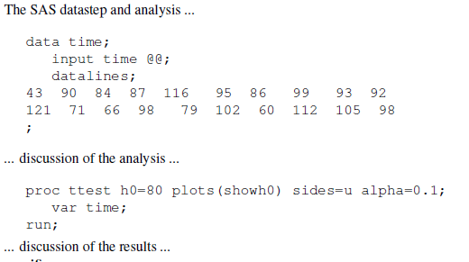
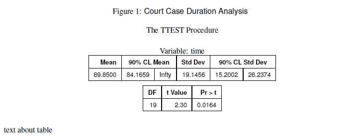
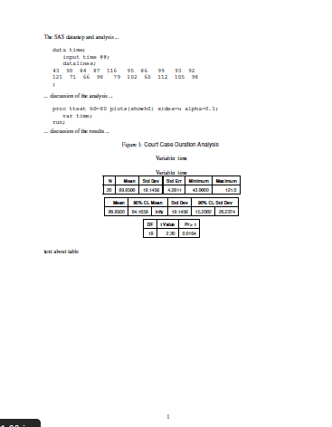
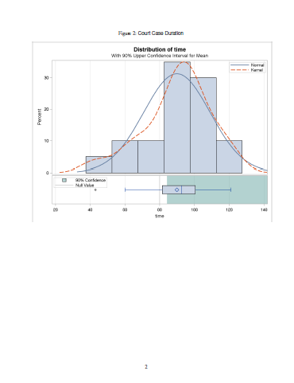
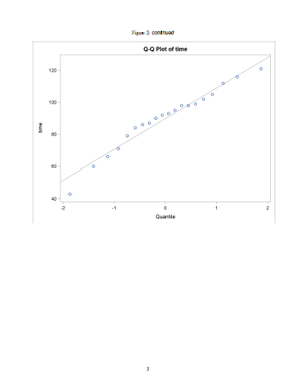
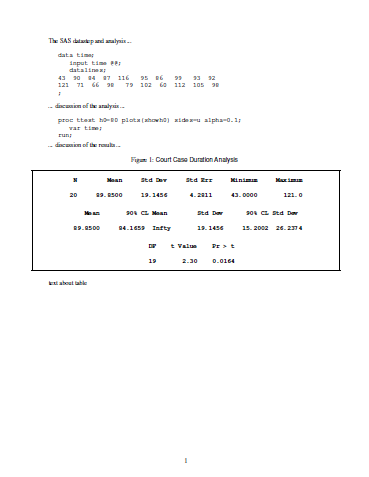

Title: SAS and LaTeX Together: The StatRep Package
Category: LaTeX
Slug: statrep-latex
Date: 11-23-2014
Tags: how-to, statrep
Summary: How to use StatRep with SAS-generated LaTeX output for reproducible research.

**Table of Contents**

[TOC]

### Overview {: .article-title}

This short article shows how you can use **StatRep** to capture and display SAS-generated output to create dynamic documents. With the most recent release of the **StatRep** package, you can now create and display SAS-generated LaTeX output in your LaTeX documents. 

The **StatRep** system for reproducible research was introduced at the 2012 SAS Global Forum, in this [paper](http://support.sas.com/resources/papers/proceedings12/324-2012.pdf). You can download the package from the links given at the end of this article.
{: .callout}

The **StatRep** package enables you to create dynamic documents using SAS and LaTeX. It is composed of one LaTeX package (``statrep.sty``) and a suite of SAS macros, (``statrep_macros.sas``) that work together to capture and display SAS output. This enables you to write all of your data, code, and discussion in a single source file (your LaTeX document); that file can be shared with others and you can be sure that the output others see is generated from the code you used to create the analysis. No more copying and pasting of code blocks!

Your document is processed in four steps:

1. Write your LaTeX document using custom markup from the **StatRep** package.
2. Compile the document with pdfLaTeX; this step generates a SAS program to capture the output needed in your document.
3. Run that generated SAS program to produce the output.
4. Recompile the document with pdfLaTeX; now your code and output appear in the final PDF document.

### Configuration {: .article-title}

There are several "hooks" in the **StatRep** configuration that you can set in order to make the package work with your preferences. These hooks are explained in detail in the *User's Guide*; see the section on customization and the installation instructions. 

While the defaults have been carefully chosen, there are two settings that deserve some special consideration.

#### The ``statrep_macros.sas`` File {: .article-title}

The location of the file ``statrep_macros.sas`` must be set so that the generated SAS program will function correctly. Set the location with the ``\SRmacropath`` variable in your ``statrep.cfg`` file. 

If you do not set this variable, SAS will expect the macros to be in the current directory (the one that contains the program and your LaTeX document). Nothing wrong with that, just make sure the file is in that directory when you run the generated SAS program.

#### The SAS ODS Output Destination {: .article-title} 

When you download and install the **StatRep** package, the default ODS destination is the ODS Listing; (because the default value of the ``\SRdefaultdests`` configuration variable is ``listing``). SAS-generated output is displayed as it appears in the listing window. You can alternatively have SAS create output as LaTeX tables.  There are two ways to select SAS-generated LaTeX output.

1. You can modify the configuration in the ``statrep.cfg`` file to make the default the ODS **StatRep** LaTeX tagset by changing the value of ``\SRdefaultdests`` to ``latex``. 

2. Alternatively, you can leave the ``\SRdefaultdests`` configuration variable as it is and modify your ``\Listing`` tag in your LaTeX document. Specify the ODS destination on the ``\Listing`` tag itself, as in the example below, which sets the ``dest=latex`` option. 

If the global default ``\SRdefaultdests`` is set to ``latex``, there is no need to specify it again on the ``\Listing`` tag.
{: .callout}

In either case, whether you change the global configuration variable or add the ``dest=`` option to your ``\Listing`` tags, SAS will need access to the **StatRep** tagset in order to generate the output. 

Bundled in the **StatRep** package is a SAS program that creates a new tagset base on the ODS LaTeX tagset. You create the tagset by running the included SAS program, ``statrep_tagset.sas``. 

### The StatRep Tagset and Style {: .article-title}

If you want your output to be generated in LaTeX format rather than the listing format, you first must create a special tagset for SAS to use. This is easily done--just run the included SAS program ``statrep_tagset.sas``.

The *User's Guide* provides complete details on how to create SAS-generated LaTeX output. The main points are that you must create the ``statrep.tagset`` with the included SAS program, ``statrep_tagset.sas``, and you must tell SAS to use the tagset when creating the output. You can run the tagset generation code each time you use **StatRep** or you can save the tagset. By default, the tagset is saved to the SASUSER.TEMPLAT item store. Full details on installing tagsets are available in this [Usage Note](http://support.sas.com/kb/32/394.html)

If you want to run the tagset generation code each time, you can change the way **StatRep** includes the macros. Your file ``statrep.cfg`` will change so the definition for ``\SRmacroinclude`` appears as follows:

    :::latex
    \SRmacroinclude{%
      \@percentchar include "statrep_tagset.sas" /nosource;
      \@percentchar include "\SRmacropath" /nosource;
    }

With this definition, the generated SAS program first creates the **StatRep** tagset before creating the output for your document. 

### Examples {: .article-title}

In the examples that follow, the following document preamble, data step and proc step are used. Make sure you have already created the **StatRep** tagset, described above.

    :::latex
    \documentclass{article}
    \usepackage[margin=1in]{geometry}
    \usepackage{statrep}
    \begin{document}
    
    The SAS datastep and analysis ...
    
    \begin{Datastep}
    data time;
       input time @@;
       datalines;
     43  90  84  87  116   95  86   99   93  92
    121  71  66  98   79  102  60  112  105  98
    ;
    \end{Datastep}

    ... discussion of the analysis ...

    \begin{Sascode}[store=myoutput]
    proc ttest h0=80 plots(showh0) sides=u alpha=0.1;
       var time;
    run;
    \end{Sascode}

    ... discussion of the results ...

The final PDF output from the preceding code looks like this:
{: .center_border}

In the document snippet above, the code creates a SAS data set ``time`` and invokes the TTEST procedure.  The result is that all output created by the TTEST procedure is contained in an ODS document named ``myoutput`` as specified by the option ``store=myoutput``. 

So far, no output is displayed--the output that is displayed is determined by the ``\Listing`` and ``\Graphic`` tags that follow. This is how **StatRep** works: the code block generates all the output at one time and stores it in the ODS document so it can be used at any point in the document.
{: .callout}

In the sections that follow, the ``\Listing`` and ``\Graphic`` tags request the ODS document to replay output objects into external files (on disk). When the final document is recompiled, pdfLaTeX embeds and displays those outputs.

#### Capture All Outputs as a Single Stream {: .article-title}

In this example, the output tags make no request for specific outputs. When you make no explicit output selection, the ``Listing`` tag selects all tables and notes. 

    :::latex
    \Listing[store=myoutput, dest=latex, 
             caption={Court Case Duration Analysis}]{myouta}
    text about table

The ``\Listing`` tag specifies:

- that output should come from the ODS document ``myoutput`` which matches the ``store=`` option on the ``Sascode`` block
- the output destination is ``latex`` 
- caption for the output
- filename that contains the output is ``lst/myouta.lst``

The output from the above code looks like this:
{: .center_border}

When you run the generated SAS program, the SAS Log displays the ODS objects that are selected for replay. These outputs are displayed in your document as a continuous stream of output with page breaks handled automatically. That is, the output can go over a page break, with breaks allowed only between ODS objects. The SAS Log displays the following table that corresponds to the ``\Listing`` tag:

    Objects                   Type  Status   Group

    Ttest.time.PT             Note  Selected   1
    Ttest.time.Statistics     Table Selected   1
    Ttest.time.ConfLimits     Table Selected   2
    Ttest.time.TTests         Table Selected   3
    Ttest.time.SummaryPanel   Graph            .
    Ttest.time.QQPlot         Graph            .

Next, add some graphical output to your document with the ``\Graphic`` tag

    :::latex
    \Graphic[store=myoutput, 
             caption={Court Case Duration}]{myoutb}

The ``\Graphic`` tag specifies

- that output should come from the ODS document ``myoutput`` which matches the ``store=`` option on the ``Sascode`` block
- caption for the output
- filename that contains the output is ``png/myoutb.png``

The ``Graphic`` tag selects all graphs by default. The SAS Log displays the following table that corresponds to the ``\Graphic`` tag:

    Objects                   Type  Status   Group

    Ttest.time.PT             Note             .
    Ttest.time.Statistics     Table            .
    Ttest.time.ConfLimits     Table            .
    Ttest.time.TTests         Table            .
    Ttest.time.SummaryPanel   Graph Selected   1
    Ttest.time.QQPlot         Graph Selected   2

The final PDF document, which specifies the ``latex`` destination and uses the **StatRep** tagset, looks like this:

{: .border}{: .border}
{: .border}

For comparison, the following screenshots show the final PDF document if you use the default ``listing`` destination. Only the tabular output has changed; the graphs are identical.

{: .center_border}

#### Capture Specific Outputs {: .article-title}

You don't always want the output to displayed as a continuous, uninterrupted stream, so **StatRep** provides a flexible way to select ODS objects. In the following ``\Listing`` tag, the ``firstobj=`` option specifies that the output stream should begin with the ``ConfLimits`` object; the ``lastobj=`` option specifies that the output stream should end with the ``TTests`` object. 

    :::latex
    \Listing[store=myoutput, dest=latex, 
             firstobj=conflimits, lastobj=ttests,
             caption={Court Case Duration Analysis}]{myoutc}

Suppose there were several objects in the ODS document between those two specified objects; they would all be included with this one ``\Listing`` tag.
**StatRep** provides many other methods of ODS object selection; see the *User's Guide* for details.

By specifying the same ODS document in different ``\Listing`` tags, you can show the outputs in any order or break them up into parts so you can discuss particular outputs. Your SAS code is only run one time--when the ODS document is created. You can replay the output from that ODS document in any order you like.
{: .callout}

When you run the generated SAS program, the resulting SAS Log shows that the output objects ``ConfLimits`` and ``TTests`` are selected.

    Objects                   Type  Status   Group

    Ttest.time.PT             Note             .
    Ttest.time.Statistics     Table            .
    Ttest.time.ConfLimits     Table Selected   1
    Ttest.time.TTests         Table Selected   2
    Ttest.time.SummaryPanel   Graph            .
    Ttest.time.QQPlot         Graph            .

The ``\Graphic`` tag uses the ``objects=`` option to specify that a single graph is to be captured and displayed, the ``qqplot`` object. Typically, the ``objects=`` option contains a space-separated list of ODS objects; in this case however, only one plot is selected.

    :::latex
     \Graphic[store=myoutput, 
              objects=qqplot,
              caption={Court Case Duration}]{myoutd}

The log shows that only the ``QQPlot`` object is selected.

    Objects                   Type  Status   Group

    Ttest.time.PT             Note             .
    Ttest.time.Statistics     Table            .
    Ttest.time.ConfLimits     Table            .
    Ttest.time.TTests         Table            .
    Ttest.time.SummaryPanel   Graph            .
    Ttest.time.QQPlot         Graph Selected   1

### Summary {: .article-title}

This article provides a couple of simple examples that show you how to get started with **StatRep** and generate LaTeX output with SAS. The *User's Guide* also provides simple examples, but includes more in-depth, advanced usage.

You can download the package from:

- [support.SAS.com](http://support.sas.com/rnd/app/papers/statrep.html)
- [CTAN.org](http://www.ctan.org/tex-archive/macros/latex/contrib/statrep)

Do you have an example you'd like to see or a question about **StatRep**? Leave a comment!

